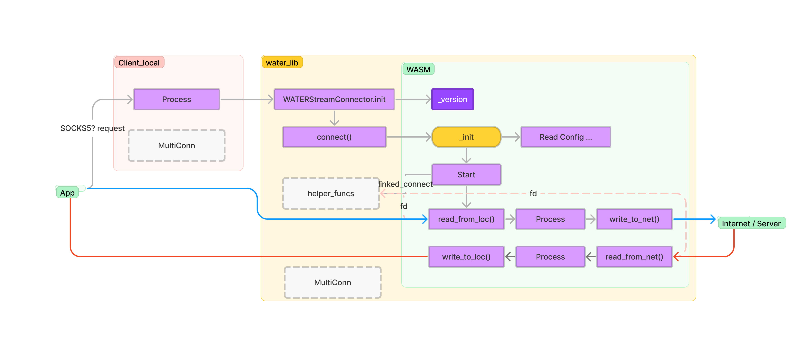

# Rust APIs -- `water`

Library docs will be availale soon on `docs.rs`, for now you can run `cargo doc --no-deps --open` to generate the docs locally.

## External (Caller Facing)

<figure><figcaption><p>design diagram draft1</p></figcaption></figure>

## Examples

<details>

<summary>Example 1: v0 simple tcp connection sending plain text</summary>

```rust
// Some config.json file with the following configs
// 	{
// 		"remote_address": "127.0.0.1",
// 		"remote_port": 8080,
// 		"local_address": "127.0.0.1",
// 		"local_port": 8088
// 	}
    
// construct the config
let conf = config::WATERConfig::init(
    String::from("./test_wasm/plain.wasm"),
    String::from("_water_worker"),
    String::from("above_config.json"),
    config::WaterBinType::Dial,
    true,
)
.unwrap();

// creating the WATER client
let mut water_client = runtime::client::WATERClient::new(conf).unwrap();

// connecting to the remote_address:remote_port
water_client.connect().unwrap();

// setup the cancel pipe for exiting
water_client.cancel_with().unwrap();

// run the worker in WATM which is running in a separate thread
let handle_water = water_client.run_worker().unwrap();

let test_message = b"hello";

// sending to the remote end with the packaging logic (here is plain, depends on the WATM)
water_client.write(test_message).unwrap();

// reading from the remote end with the unpackaging logic (here is plain, depends on the WATM)
let mut buf = vec![0; 32];
let res = water_client.read(&mut buf);

// close the connection
water_client.cancel().unwrap();

// clean things up and wait for the thread to join
drop(file);
dir.close()?;
handle.join().unwrap();
match handle_water.join().unwrap() {
    Ok(_) => {}
    Err(e) => {
        eprintln!("Running _water_worker ERROR: {}", e);
        return Err(Box::new(Error::new(
            ErrorKind::Other,
            "Failed to join _water_worker thread",
        )));
    }
};
```
</details>

<details>

<summary>Example 2: v1 shadowsocks</summary>

```rust
// first setup the official shadowsocks_server end on port 8088
const SERVER_ADDR: &str = "127.0.0.1:8088";
const LOCAL_ADDR: &str = "127.0.0.1:8081";

// have the shared password
const PASSWORD: &str = "WATERisAwesome!23";

// using CHACHA20 as the cipher method
const METHOD: CipherKind = CipherKind::CHACHA20_POLY1305;

let svr = Socks5TestServer::new(SERVER_ADDR, LOCAL_ADDR, PASSWORD, METHOD, false);
svr.run().await;

// Some config.json file with the following configs
// {
//     "remote_address": "127.0.0.1",
//     "remote_port": 8088,
//     "local_address": "127.0.0.1",
//     "local_port": 8080,
//     "password": "WATERisAwesome!23",
//     "bypass": false
// }

// construct the config
let conf = config::WATERConfig::init(
    String::from("./test_wasm/ss_client_wasm.wasm"),
    String::from("v1_listen"),
    String::from("above_config.json"),
    // Runner type is currently for the relay implementation for v1
    config::WaterBinType::Runner,
    true,
)
.unwrap();

// creating the WATER client
let mut water_client = runtime::client::WATERClient::new(conf).unwrap();

// spawn a thread to run the Shadowsocks client WATM
thread::spawn(move || {
    water_client.execute().unwrap();
});

// creating the SocketAddr for ss_client
let wasm_ss_client_addr = SocketAddr::new("127.0.0.1".parse().unwrap(), 8080);

// Give some time for the WASM client to start
thread::sleep(Duration::from_millis(100));

// test the Shadowsocks client WATM
let mut c = Socks5TcpClient::connect(
    Address::DomainNameAddress("detectportal.firefox.com".to_owned(), 80),
    wasm_ss_client_addr,
)
.await
.unwrap();

let req = b"GET /success.txt HTTP/1.0\r\nHost: detectportal.firefox.com\r\nAccept: */*\r\n\r\n";
c.write_all(req).await.unwrap();
c.flush().await.unwrap();

let mut r = BufReader::new(c);

let mut buf = Vec::new();
r.read_until(b'\n', &mut buf).await.unwrap();

let http_status = b"HTTP/1.0 200 OK\r\n";
assert!(buf.starts_with(http_status));
```
</details>

More example usages can be found in `./tests/tests/`.

## Designs
**execute**: 
1. wasmtime runtime creation
2. Setup env:
    1. memory initialiation & limitation
    2. (`v1_preview` feature) wasm_config sharing to WASM
    3. export helper functions (e.g. creation of TCP, TLS, crypto, etc)
3. Run the `entry_fn` or execute as the Role (`Dial`, `Listen`, `Relay`)
